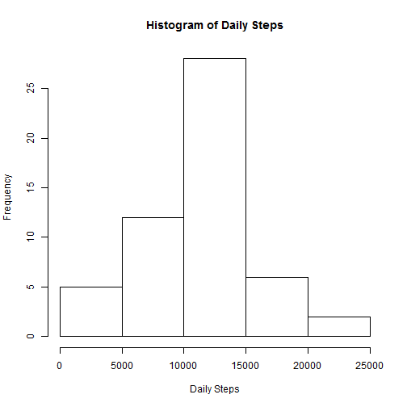
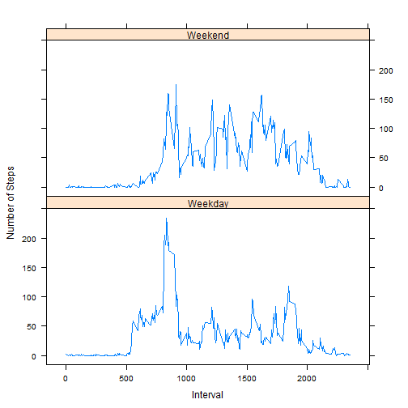

# Reproducible Research: Peer Assessment 1


## Loading and preprocessing the data
We first need to set the directory to where the file is at. You will need to change the directory yourself. The code to change the directory is:

```r
setwd("E:/Dropbox/Data Science Coursera/Reproducible Research/Project 1/RepData_PeerAssessment1")
```

After the directory is set, we can unzip the file and read the data. Afterward we take an look at the head of the data to make sure the data is read correctly.

```r
unzip("activity.zip")
data <- read.csv("activity.csv")
head(data)
```

```
##   steps       date interval
## 1    NA 2012-10-01        0
## 2    NA 2012-10-01        5
## 3    NA 2012-10-01       10
## 4    NA 2012-10-01       15
## 5    NA 2012-10-01       20
## 6    NA 2012-10-01       25
```

## What is mean total number of steps taken per day?
Since every row of the data is a 5 minutes interval. We need to summarize the data by each day. I choose to use the plyr package to accomplish it. I use the following code.

```r
require(plyr)
data_byday <- ddply(data,.(date),summarize,TotalSteps=sum(steps))
head(data_byday)
```

```
##         date TotalSteps
## 1 2012-10-01         NA
## 2 2012-10-02        126
## 3 2012-10-03      11352
## 4 2012-10-04      12116
## 5 2012-10-05      13294
## 6 2012-10-06      15420
```
We can now make a histogram of the daily steps each day.

```r
hist(data_byday$TotalSteps,xlab="Daily Steps",main="Histogram of Daily Steps")
```

 

We can also calculate the mean of daily step.

```r
mean(data_byday$TotalSteps,na.rm=TRUE)
```

```
## [1] 10766
```

We can also calculate the median of daily step.

```r
median(data_byday$TotalSteps,na.rm=TRUE)
```

```
## [1] 10765
```

## What is the average daily activity pattern?
In order to plot the daily activity pattern, we need to summarize the data by each interval. I use the following code to do that

```r
data_bymin <- ddply(data,.(interval),summarize,AveStep=mean(steps,na.rm=TRUE)) ## remove NA
head(data_bymin)
```

```
##   interval AveStep
## 1        0 1.71698
## 2        5 0.33962
## 3       10 0.13208
## 4       15 0.15094
## 5       20 0.07547
## 6       25 2.09434
```
We can now plot the daily pattern.

```r
with(data_bymin,plot(interval,AveStep,type="l",xlab="Interval",ylab="Number of Steps",main="Daily Steps Pattern"))
```

 

## Imputing missing values
### Basic charastic of missing values
It is clear that the data have some missing value. Before we fill in the missing value, it is important to take a look at the structure of the missing value. In particular, I am interested in whether the missing value appears randomly or appear only on specific dates. To accomplish this, I summaries the data by counting number of NA as well as total number of interval for each date. In the following code, ```NACount``` is the number of interval that is NA for each date. ```TotalCount``` is the total number of interval for each date.

```r
data_na <- ddply(data,.(date),summarize,NACount = sum(is.na(steps)), TotalCount = length(steps))
subset(data_na,NACount>0)
```

```
##          date NACount TotalCount
## 1  2012-10-01     288        288
## 8  2012-10-08     288        288
## 32 2012-11-01     288        288
## 35 2012-11-04     288        288
## 40 2012-11-09     288        288
## 41 2012-11-10     288        288
## 45 2012-11-14     288        288
## 61 2012-11-30     288        288
```
Looking from the resulting data, it is clear that NA only appear for specific dates. In addition, when it appear, all value is NA for that date.

### Replace by 0
One way to impute the data is to replace it with 0.

```r
newdata1 <- data
newdata1$steps <- ifelse(is.na(newdata1$steps),0,newdata1$steps)
newdata1_byday <- ddply(newdata1,.(date),summarize,TotalSteps=sum(steps))  ## summarize by day
```
Now we can calculate the difference in mean and median after we replace NA with 0.

```r
mean(data_byday$TotalSteps,na.rm=TRUE)-mean(newdata1_byday$TotalSteps,na.rm=TRUE)
```

```
## [1] 1412
```

```r
median(data_byday$TotalSteps,na.rm=TRUE)-median(newdata1_byday$TotalSteps,na.rm=TRUE)
```

```
## [1] 370
```
It is not surprising that we will get different mean and median if we replace NA with 0.

### Replace by average value
Alternatively, we replace NA with the mean value for that 5 minutes interval. The following code would accomplish that.

```r
newdata2 <- merge(data,data_bymin,by.x="interval",by.y="interval")  
newdata2$steps <- ifelse(is.na(newdata2$steps),newdata2$AveStep,newdata2$steps)  ## Replace missing data with average
newdata2_byday <- ddply(newdata2,.(date),summarize,TotalSteps=sum(steps))  ## summarize by day
```
Now we can calculate the difference in mean and median after we replace NA with 0.

```r
mean(data_byday$TotalSteps,na.rm=TRUE)-mean(newdata2_byday$TotalSteps,na.rm=TRUE)  ## Difference in mean
```

```
## [1] 0
```

```r
median(data_byday$TotalSteps,na.rm=TRUE)-median(newdata2_byday$TotalSteps,na.rm=TRUE)  ## Difference in median
```

```
## [1] -1.189
```
The difference in mean in 0 since we replace NA with mean in the interval.

## Are there differences in activity patterns between weekdays and weekends?
We first add a column in ```data``` to indicate whether the date is a weekday or weekend. Then we use can summarize the data by both interval and weekend of not.

```r
data$weekend <- ifelse(weekdays(as.Date(data$date))=="Saturday"|weekdays(as.Date(data$date))=="Sunday","Weekend","Weekday")
data_byweekday <- ddply(data,.(interval,weekend),summarize,AveStep=mean(steps,na.rm=TRUE))  ## summarize by interval and weekend
require(lattice)
xyplot(AveStep ~ interval | weekend, data=data_byweekday,layout=c(1,2),type="l",xlab="Interval",ylab="Number of Steps")
```

 

Note that all NA is ignored. Judging from the plot, steps number seems to exhibit different pattern during weekend compared to during weekday.
